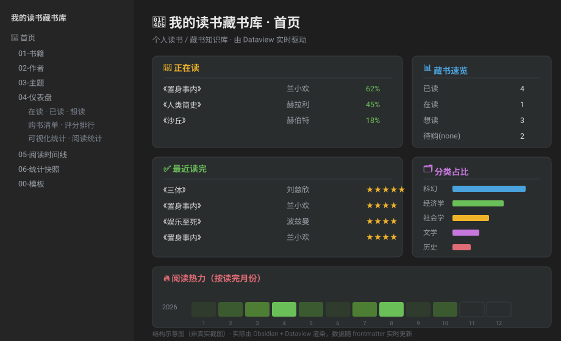

# 阅镜 ReadLens · 阅读智能工具箱

<!-- CI 徽章在把仓库推到 GitHub 后生效；PyPI 徽章在发布到 PyPI 后生效 -->
[](https://github.com/zjsthmjialin/readlens/actions/workflows/ci.yml)
[](https://pypi.org/project/readlens/)
[](https://pypi.org/project/readlens/)
[](LICENSE)

ReadLens 脱胎于 [Tencent/WeChatReading](https://github.com/Tencent/WeChatReading) Skills，
在其「搜书 / 书架 / 笔记 / 阅读统计」读取能力之上，做了五层延展。

## ⚡ 30 秒上手

```bash
pip install readlens               # 或 pipx install readlens（隔离安装，推荐）
readlens quickstart --with-manual  # 用内置离线数据一键生成演示知识库，无需任何 Key
```

命令跑完会在 `./ReadLensDemo` 生成一个完整的 Obsidian 知识库——用 Obsidian
「打开文件夹作为仓库」、启用 **Dataview** 插件，打开「📖 首页」即可看到成果。

> 从源码安装：`pip install -e .`（在 clone 下来的仓库根目录）。

## 效果预览

`readlens quickstart` 生成的知识库「📖 首页」在 Obsidian 中的样子（结构示意）：



读书报告自动生成的图表（真实产物，`readlens report` 输出）：

<p align="center">
  
  
</p>

> 想在本地跑出同款：`readlens quickstart --with-manual` 生成知识库，用 Obsidian 打开、
> 启用 Dataview 即可；`readlens report` 生成 HTML 报告与图表。

## 五大能力

1. **平台适配层** — 把「阅读平台」抽象成统一接口，可复刻到微信读书之外的平台
2. **多格式导出** — 笔记一键导出为 Markdown / Obsidian / Notion
3. **读书报告** — 月度/年度报告，自动生成图表可视化
4. **AI 增值** — 笔记总结、跨书主题串联、读书问答、个性化推荐
5. **📚 Obsidian 知识库** — 把读书笔记 + 手动藏书生成一个深度适配 Dataview 的
   个人读书/藏书知识库：每本书一张笔记、作者中心页、主题 MOC、仪表盘、时间线，
   支持**内嵌封面图**、**DataviewJS 可视化统计**（评分分布/分类占比/各年读完/阅读热力）、
   **购书清单**、**统计快照与趋势**（每次生成落一份带日期快照、可对比），
   以及**增量更新**（重复生成不覆盖你的手写笔记与手填字段）。

## 📚 生成 Obsidian 读书/藏书知识库（推荐用法）

```bash
readlens vault --out ./MyReadingVault --manual examples/manual_collection.json
```

生成的知识库结构（用 Obsidian 打开该文件夹，启用 **Dataview** 插件即可）：

```
MyReadingVault/
├── 📖 首页.md           总览仪表盘（在读 / 已读 / 想读 / 藏书速览）
├── 01-书籍/             每本书一张笔记（微信读书导入 + 手动录入共存）
├── 02-作者/            作者中心页（Dataview 自动汇总）
├── 03-主题/           主题 MOC（按分类聚合）
├── 04-仪表盘/         在读 / 已读 / 想读 / 购书清单 / 评分排行 / 藏书清单 / 阅读统计 / 可视化统计
├── 05-阅读时间线.md
├── 06-统计快照/       history.json（累积快照）+ 趋势.md（与上期对比）
├── 00-模板/          书籍模板 + 藏书模板（配合 Templater/QuickAdd）
└── README.md
```

- **微信读书导入**：`source: weread`，默认电子书，带划线/想法/热门划线。
- **手动藏书**：`--manual <json>` 传入，或在 Obsidian 里用模板新建；可填纸质位置、
  价格、购入渠道。两类内容共存，仪表盘统一呈现。
- frontmatter 字段规范化（status/rating/owned/source…），改任意字段仪表盘实时更新。
  详见 [`skills/vault.md`](skills/vault.md)。
- **增量更新（默认）**：重复运行 `vault` 只刷新自动区，你的手写笔记（`## 我的笔记`
  等）与手填字段（评分/位置/价格…）都会保留；`--overwrite` 可强制全量重建。

> 开箱即用：内置离线 `mock` 数据 + 离线 AI 引擎，**无需 API Key** 就能跑通全部流程。

## 路线图

完整的待做功能清单（含优先级与验收标准）见 [`docs/FEATURES.md`](docs/FEATURES.md)。
近期计划：PyPI 正式发布、购书清单、豆瓣元数据增强、文档与截图完善。

## 与原项目的关系

| | Tencent/WeChatReading | ReadLens（本项目） |
|---|---|---|
| 形态 | 面向 Agent 的 Skill `.md` 文档 | 可运行 Python 项目 + 延展 Skill 文档 |
| 平台 | 仅微信读书 | 适配层，微信读书 + mock，可扩展 |
| 笔记 | 读取内容 | 读取 + 多格式导出（含双链/Notion blocks） |
| 统计 | 返回数据 | 数据 + 图表 + HTML 报告 |
| AI | 交由外部 Agent | 内置总结/主题/问答/推荐（离线可跑，可接 LLM） |
| 写操作 | 无 | 预留 `add_to_shelf` / `create_thought` 接口 |

## 快速开始

```bash
pip install -r requirements.txt          # 或 pip install -e .
python examples/demo.py                   # 无需 Key，一键跑通四大能力
```

CLI（默认离线 mock 平台）：

```bash
readlens quickstart                       # 一键生成演示知识库（无需 Key）
readlens search 三体
readlens shelf
readlens export --format markdown --out ./export_output
readlens export --format obsidian --out ./my_vault
readlens report --mode monthly --ai
readlens ai summarize --book b_santi
readlens ai themes --topic 文明
readlens ai ask --book b_santi --q "黑暗森林法则是什么？"
readlens ai recommend
readlens enrich                           # 预览元数据增强（补 ISBN/封面/出版信息）
readlens vault --enrich --out ./MyVault   # 生成知识库时顺带补全元数据
```

## 原生 Obsidian 插件（可选，甩掉 Dataview）

阅镜自带一个 Obsidian 插件（`plugin/`），**原生渲染**读书仪表盘——KPI 卡片、评分分布、
分类圆环、阅读热力、书单表格、首页概览、作者/主题视图，**完全不依赖 Dataview**，Apple 风设计。

```bash
readlens vault --dashboards plugin --out ./MyVault
```
这样生成的整库仪表盘都用插件的 ```readlens``` 块渲染，零 Dataview。插件安装见 [`plugin/README.md`](plugin/README.md)。

## 定时自动化（让知识库自动生长）

一条命令跑完整个流程——拉数据 → 增量更新知识库 → 生成周/月/年报 → 落统计快照：

```bash
export WEREAD_API_KEY=wrk-你的key     # 设了 key 自动启用微信读书，无需 --platform
readlens sync --out ./MyVault        # 默认一次生成周/月/年三份报告
```

想只出某一种：`readlens sync --out ./MyVault --report-mode monthly`（可多选，或 `none` 不生成）。
再用 macOS launchd 或 cron 定时跑它，知识库就会每周/每月自动更新、自动出报告。
配置见 [`docs/AUTOMATION.md`](docs/AUTOMATION.md)。周期报告写入知识库的 `07-报告/`，
`06-统计快照/趋势.md` 自动累积对比。

## 接入真实数据

1. 复制配置：`cp config.example.yaml config.yaml`，把 `platform` 改为 `weread`
2. 设置微信读书 Key（从 https://weread.qq.com/r/weread-skills 获取）：
   ```bash
   export WEREAD_API_KEY=wrk-xxxxxxxx
   ```
3. （可选）接入 LLM 提升 AI 质量：
   ```bash
   export OPENAI_API_KEY=sk-xxxxxxxx      # 设置后 AI 自动从离线引擎切换到真实 LLM
   ```

## 目录结构

```
readlens/
├── adapters/        平台适配层（base 抽象 + weread + mock）
│   ├── base.py      ReadingPlatform 统一接口
│   ├── weread.py    微信读书适配器（网关协议）
│   └── mock.py      离线示例数据（复刻新平台的参照）
├── models.py        统一数据模型 Book/Highlight/Thought/Note/ReadStat
├── export/          markdown / obsidian / notion 导出
├── report/          报告生成器 + matplotlib 图表
├── ai/              engine 抽象 + summarize/themes/qa/recommend
├── vault/           Obsidian 知识库生成器（builder + 模板）
└── cli.py           命令行入口
skills/              面向 Agent 的延展 Skill 文档（export/report/ai/platforms）
examples/demo.py     端到端演示
tests/               单元测试
```

## 复刻到新平台

实现一个 `ReadingPlatform` 子类，把该平台原始字段映射到统一模型即可，
上层导出/报告/AI 自动复用。详见 [`skills/platforms.md`](skills/platforms.md)。

## 常见问题（FAQ）

**Q：一定要有微信读书 Key 吗？**
不用。内置离线 `mock` 数据 + 离线 AI 引擎，`readlens quickstart` 无需任何 Key 即可产出完整知识库。接真实数据才需要 Key。

**Q：Obsidian 里仪表盘/统计页不显示？**
需在 Obsidian 安装并启用社区插件 **Dataview**；「可视化统计」「购书清单」用的是 DataviewJS，还需在 Dataview 设置里开启 *Enable JavaScript Queries*。

**Q：重新生成会覆盖我在笔记里手写的内容吗？**
不会。默认**增量更新**：只刷新自动区，`## 我的笔记` 等手写区与手填字段（评分/位置/价格/优先级…）都保留。想彻底重建用 `readlens vault --overwrite`。

**Q：想买的书怎么管理？**
把书的 `owned` 设为 `none`，可选 `priority: 高/中/低` 与 `price_target`，它们会自动出现在「购书清单」并按优先级排序。

**Q：怎么接入我自己的微信读书数据？**
`cp config.example.yaml config.yaml`，设 `WEREAD_API_KEY`，再 `readlens vault --platform weread --out ./MyVault`。详见「接入真实数据」。

**Q：AI 分析质量一般？**
离线引擎是抽取式占位。设 `OPENAI_API_KEY` 后会自动切换到真实 LLM，质量显著提升。

## 路线图与发布

- 运作机制与使用手册：[`docs/GUIDE.md`](docs/GUIDE.md)
- 更新日志：[`CHANGELOG.md`](CHANGELOG.md)
- 完整功能清单：[`docs/FEATURES.md`](docs/FEATURES.md)
- 发布到 PyPI 的操作手册：[`docs/RELEASE.md`](docs/RELEASE.md)
- 参与贡献：[`CONTRIBUTING.md`](CONTRIBUTING.md)

## 许可证

Apache-2.0 — 参考并延展自 Tencent/WeChatReading（Apache-2.0）。


