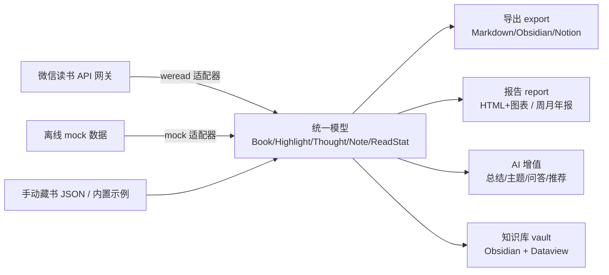

# 阅镜 ReadLens · 运作机制与使用手册

一份把「它怎么运作」和「你怎么用」讲透的完整指南。读完你就能独立驾驭整个项目。

---

## 一、它解决什么

把分散在阅读平台（微信读书）里的读书数据——书目、划线、想法、阅读统计——加上你的手动藏书，
沉淀成一个**可导出、可分析、可持续生长的个人知识库**。最终形态是一个深度适配 Dataview 的
**Obsidian 读书/藏书库**：每本书一张互相链接的笔记，配合仪表盘和自动报告，成为你的「读书大脑」。

---

## 二、整体运作机制（一条数据流水线）

核心是一条**分层解耦**的流水线：任何一个阅读平台的原始数据，先被「适配器」翻译成一套
**统一数据模型**，之后所有上层能力（导出 / 报告 / AI / 知识库）都只认这套统一模型，
不再关心数据来自哪个平台。



**为什么这样设计**（四个关键决策）：

1. **适配器模式**：新增一个平台 = 写一个 `ReadingPlatform` 子类做字段映射，上层零改动。
   `mock` 适配器就是「离线示例数据」，也是复刻新平台时的最佳参照。
2. **统一模型是契约**：`readlens/models.py` 定义 Book/Highlight/Thought/Note/ReadStat。
   上层只依赖它，所以平台和输出形态可以各自独立演化。
3. **离线可跑是硬约束**：没有任何 API Key 时，用 `mock` 平台 + `offline` AI 引擎能跑通全部流程。
   这保证任何人 `pip install` 后立刻能体验，也让开发/测试不依赖真实账号。
4. **知识库的 frontmatter 是 Dataview 契约**：书籍笔记头部的 `status / rating / owned / source /
   category / priority …` 字段名和取值，被仪表盘里的 Dataview 查询依赖。改字段要同步改查询。

---

## 三、模块地图（每个目录干什么）

```
readlens/
├── models.py         统一数据模型（所有上层的共同语言）
├── config.py         配置加载：默认值 + config.yaml + 环境变量（三层合并）
├── adapters/         平台适配层
│   ├── base.py       ReadingPlatform 抽象接口
│   ├── mock.py       离线示例数据（无 Key 可跑）
│   ├── weread.py     微信读书适配器（真实网关，已线上联调）
│   └── __init__.py   get_platform() 工厂，按配置选适配器
├── enrich/           元数据增强：给缺字段的书补 isbn/cover/publisher/pubdate
│   ├── base.py mock.py douban.py   可插拔来源（mock 离线 / douban 在线降级）
├── export/           导出：markdown / obsidian / notion
├── report/           报告：generator(HTML+matplotlib 图表) + digest(周/月/年报 markdown)
├── ai/               engine(offline/openai) + summarize/themes/qa/recommend
├── vault/            知识库生成器
│   ├── builder.py    主逻辑：书籍/作者/主题/仪表盘/可视化/首页/时间线
│   ├── merge.py      增量更新：标记注释包裹自动区 + 保护手填 frontmatter
│   ├── snapshot.py   统计快照与趋势
│   └── templates.py  模板与 README 文本
└── cli.py            命令行入口（argparse，所有子命令在这里挂载）
```

---

## 四、怎么用

### 4.1 安装

```bash
pip install readlens          # 或 pipx install readlens（隔离安装）
# 从源码：进仓库根目录 pip install -e .（需 pip ≥ 21.3）
# 老 pip：pip install requests pyyaml jinja2 matplotlib，然后用 python3 -m readlens.cli ...
```

### 4.2 零门槛体验（无需 Key）

```bash
readlens quickstart --with-manual     # 用内置离线数据生成一个完整演示知识库到 ./ReadLensDemo
```
用 Obsidian「打开文件夹作为仓库」选 `ReadLensDemo`，启用 **Dataview** 插件，打开「📖 首页」。

### 4.3 接入你自己的微信读书

```bash
export WEREAD_API_KEY=wrk-你的key      # 从 https://weread.qq.com/r/weread-skills 获取
readlens weread-check                  # 先诊断鉴权是否通
readlens vault --out ./MyVault         # 设了 key 会自动用 weread，无需 --platform
```
> 便利机制：只要设了 `WEREAD_API_KEY`，平台自动切到 weread；没设就用离线 mock。

### 4.4 命令速查

| 命令 | 作用 |
|------|------|
| `readlens quickstart [--with-manual] [--out DIR]` | 一键生成演示知识库（离线） |
| `readlens search <关键词> [--scope book]` | 搜书 |
| `readlens shelf` | 看书架 |
| `readlens notes --book <bookId>` | 打印单本书笔记(markdown) |
| `readlens export --format markdown\|obsidian\|notion [--book ID] [--out DIR] [--single]` | 导出笔记 |
| `readlens report --mode weekly\|monthly\|annually\|overall [--ai] [--out DIR]` | 生成 HTML 报告+图表 |
| `readlens ai summarize --book ID` / `themes --topic X` / `ask --book ID --q "?"` / `recommend` | AI 分析 |
| `readlens vault --out DIR [--manual f.json] [--enrich] [--overwrite] [--no-snapshot]` | 生成/更新知识库 |
| `readlens enrich [--source mock\|douban]` | 预览元数据增强（不落库） |
| `readlens sync --out DIR [--report-mode ...]` | **自动化入口**：拉数据→增量更新→周/月/年报→快照 |
| `readlens weread-check` | 诊断微信读书网关鉴权 |
| 全局：`--platform mock\|weread`、`--config path`、`--version` | |

### 4.5 生成知识库的工作流（vault）

`readlens vault` 会：从平台拉所有有笔记的书 → （可选）合并手动藏书 → （可选）元数据增强 →
生成每本书笔记、作者页、主题 MOC、各仪表盘、时间线、首页、统计快照。
**默认增量更新**：重复运行只刷新「自动区」，你在笔记里手写的 `## 我的笔记`、以及手填的
`rating/location/price/priority/isbn…` 字段都会保留。想彻底重建加 `--overwrite`。

### 4.6 让知识库自动生长（sync + 定时）

```bash
export WEREAD_API_KEY=wrk-你的key
readlens sync --out ./MyVault          # 默认一次生成周/月/年三份报告
```
`sync` = `vault`（增量更新）+ 周期报告写入 `07-报告/` + 统计快照。幂等，可反复跑。
再用 **macOS launchd** 或 **cron** 定时跑它（见 [`AUTOMATION.md`](AUTOMATION.md)），
知识库就会按周期自动更新、自动出报告。

---

## 五、知识库结构详解

```
MyVault/
├── 📖 首页.md            总览仪表盘 + 快捷入口
├── 01-书籍/              每本书一张笔记（frontmatter + 划线/想法/书评 + 我的笔记手写区）
├── 02-作者/              作者中心页（Dataview 自动汇总该作者的书 + 「## 关于」手写区）
├── 03-主题/             主题 MOC，按 category 聚合（+ 「## 主题笔记」手写区）
├── 04-仪表盘/           在读 / 已读 / 想读 / 购书清单 / 评分排行 / 藏书清单 / 阅读统计 / 可视化统计
├── 05-阅读时间线.md      按读完时间倒序
├── 06-统计快照/         history.json（累积快照）+ 趋势.md（与上期对比）
├── 07-报告/            周报/月报/年报（sync 生成）
└── 00-模板/            新建书籍/藏书模板（配合 Templater/QuickAdd）
```

仪表盘全靠 Dataview 实时查询 frontmatter，所以你在任意一本书里改 `status` 或 `rating`，
对应仪表盘立刻更新——这就是知识库「活」起来的地方。「可视化统计」和「购书清单」用的是
DataviewJS，需要在 Dataview 设置里额外开启 *Enable JavaScript Queries*。

---

## 六、配置与环境变量

优先级：**环境变量 > config.yaml > 内置默认值**。

- `WEREAD_API_KEY`：微信读书 Key；设置后自动启用 weread 平台。
- `OPENAI_API_KEY`：设置后 AI 引擎自动从离线切换到真实 LLM（报告小结/总结质量更高）。
- `READLENS_LLM_MODEL`：指定 LLM 模型名。
- `config.yaml`（从 `config.example.yaml` 复制）：可配 `platform`、`weread.base_url/api_key/skill_version`、
  `ai.engine/model`、`export/report` 输出目录等。

---

## 七、数据口径（沿用原项目，避免误读）

- **阅读时长单位是秒**：`ReadStat.total_read_time` 等都是秒，展示时才转「x 小时 y 分钟」。
- **笔记数 = 划线 + 想法 + 书签**；书签只计数、不导出内容。
- **weread 的阅读统计只算 App 内计时阅读**：若你在纸书/Kindle 读或只收藏不读，时长可能为 0，属正常。
- **owned**：physical(纸质) / digital(电子) / none(未拥有)；weread 导入默认 digital，手动藏书默认 physical。

---

## 八、常见问题与排错

- **报告全是 0**：多为真实——该周期你没在 App 内计时阅读。看 `06-统计快照/history.json` 的
  `total_hours`（overall 全历史）判断适配器是否正常。
- **`weread-check` 返回 HTML/非 JSON**：网关地址不对或 Key 无效。正确网关是
  `https://i.weread.qq.com/api/agent/gateway`（已是默认）。
- **`--platform weread` 报 unrecognized**：它是全局选项要放子命令前；或直接设 `WEREAD_API_KEY` 让它自动启用。
- **Obsidian 仪表盘不显示**：装 Dataview 即可。生成的库**已预置 Dataview 配置**
  （JavaScript Queries 已开启、安装后自动启用），所以只需在「社区插件」里安装一次 Dataview，
  无需再做设置。`--no-obsidian-config` 可关闭预置。
- **重新生成会不会覆盖手写**：不会（默认增量）；`--overwrite` 才全量重建。

---

## 九、扩展

- **加一个阅读平台**：继承 `adapters/base.ReadingPlatform`，把该平台字段映射到统一模型，
  在 `adapters/__init__.get_platform` 注册。参照 `mock.py`。
- **加一个元数据源**：实现 `enrich/base.MetadataFetcher`，在 `enrich.get_fetcher` 注册。
- **发布新版本**：改 `__init__.py` 与 `pyproject.toml` 的版本号（保持一致）→ 跑测试 →
  推 `v*` 标签，GitHub Actions 自动发布到 PyPI。详见 [`RELEASE.md`](RELEASE.md)。

---

## 十、相关文档

- [`README.md`](../README.md) — 项目门面与快速上手
- [`FEATURES.md`](FEATURES.md) — 完整功能清单与状态
- [`AUTOMATION.md`](AUTOMATION.md) — 定时自动化配置
- [`RELEASE.md`](RELEASE.md) — 发布到 PyPI
- [`CONTRIBUTING.md`](../CONTRIBUTING.md) — 开发约定
- `skills/*.md` — 面向 Agent 的能力说明（export/report/ai/vault/enrich/automation/platforms）
